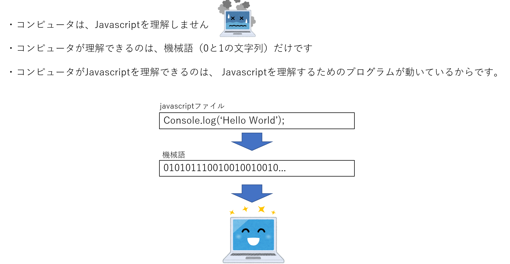

Udemyで学習した内容を記載していく。  

# Node.jsとは  

JavaScriptの実行環境の1種である  

```田中調査
他には、Deno（ディーノ）やRhinoなどの実行環境も存在する
Deno → https://qiita.com/azukiazusa/items/8238c0c68ed525377883
Rhino → https://qiita.com/duke105/items/6808ae6d91b8be8b19b2

詳しくは後日調べる...
```
# Node.jsを使った簡なJavascript実行方法  

hello.js  
```js
console.log('hello')
```
ターミナル  
```
$ node hello.js
hello
```

# 実行環境（ランタイム）とプログラムの関係性  

実行環境 → javascriptのプログラムを機械語に翻訳する役割があります。  
  


# 目次

- [環境準備]
- [Webの仕組み]

